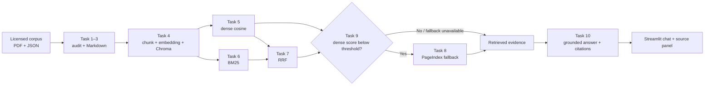

# Football RAG Pipeline

Chatbot RAG hỏi đáp có dẫn nguồn trên một corpus tiếng Anh về bóng đá. Dự án triển khai đủ chuỗi xử lý từ kiểm tra dữ liệu, chuẩn hóa Markdown, chunking/indexing, dense retrieval + BM25 + Reciprocal Rank Fusion (RRF), PageIndex fallback, sinh câu trả lời có citation, giao diện Streamlit và đánh giá A/B.

## Phạm vi corpus

Corpus là một snapshot đã được rà soát và lưu ngay trong repository để lần chạy sau không phụ thuộc nội dung website thay đổi:

- 4 PDF chính sách/quản trị từ Chính phủ Vương quốc Anh: Fan-Led Review, White Paper về quản trị câu lạc bộ, hướng dẫn về ảnh hưởng hoặc quyền kiểm soát đáng kể theo Football Governance Act 2025 và phản hồi về bóng đá nữ.
- 4 bài GOV.UK về cơ quan quản lý bóng đá độc lập, an toàn tài chính, hướng dẫn chấn động và tiêu chuẩn bóng đá nữ.
- 4 bài nghiên cứu PLOS ONE về quyết định việt vị, mô hình expected goals (xG), phát triển tài năng và dự báo chấn thương từ dữ liệu GPS.

Dữ liệu gốc nằm trong `data/landing/`; 12 tài liệu Markdown đã chuẩn hóa nằm trong `data/standardized/`. Danh mục URL, nhà xuất bản, ngày xuất bản, attribution và giấy phép được ghi tại [`data/SOURCES.md`](data/SOURCES.md). Mỗi Markdown chuẩn hóa cũng giữ metadata nguồn, URL, giấy phép và SHA-256 của file đầu vào trong YAML front matter.

## Kiến trúc Task 1–10



| Task | Vai trò |
| --- | --- |
| 1 | Kiểm tra inventory, định dạng và checksum của các PDF chính sách cục bộ. |
| 2 | Kiểm tra schema, URL, ngày crawl và tính duy nhất của 8 bài viết/nghiên cứu. |
| 3 | Chuyển PDF/JSON sang Markdown theo cách deterministic, idempotent và giữ provenance. |
| 4 | Nạp 12 tài liệu, chunk ký tự có overlap, tạo embedding và upsert ChromaDB. |
| 5 | Dense search theo cosine similarity; trả về schema `SearchResult` thống nhất. |
| 6 | BM25 lexical search trên đúng tập chunk của dense search. |
| 7 | Gộp thứ hạng dense + BM25 bằng RRF đúng một lần, loại ID trùng. |
| 8 | Upload PDF theo checksum và truy xuất PageIndex khi dịch vụ được cấu hình. |
| 9 | Điều phối dense/BM25/RRF; quyết định fallback bằng cosine score gốc của dense. |
| 10 | Chọn provider sinh câu trả lời (extractive hoặc LLM), kiểm tra citation và safe refusal. |

Các schema và invariant chi tiết nằm trong [`docs/MODULE_CONTRACTS.md`](docs/MODULE_CONTRACTS.md).

## Cài đặt

Yêu cầu Python `>=3.10,<3.14`; dự án khuyến nghị Python 3.11 theo `mise.toml`. Các lệnh dưới đây dùng PowerShell trên Windows:

```powershell
py -3.11 -m venv .venv
.\.venv\Scripts\Activate.ps1
python -m pip install --upgrade pip setuptools wheel
python -m pip install -e ".[dev]"
Copy-Item .env.example .env
```

Nếu PowerShell chặn activation script, có thể gọi trực tiếp `.\.venv\Scripts\python.exe` trong từng lệnh. Không commit `.env`, API key, `pageindex_doc_ids.json` hoặc thư mục `chroma_db/`.

## Chạy hoàn toàn offline cho ingest, retrieval và evaluation

Cấu hình mặc định trong `.env.example` dùng feature-hashing embedding 1024 chiều. Chế độ này deterministic, không tải model và không cần API key; phù hợp để tái hiện lab, chạy test và đánh giá A/B. Đây không phải embedding ngữ nghĩa đã huấn luyện, nên chất lượng dense retrieval sẽ thấp hơn cấu hình production.

```powershell
$env:EMBEDDING_PROVIDER = "hash"
$env:EMBEDDING_MODEL = "hash-1024"
$env:EMBEDDING_DIM = "1024"

# Task 1–3: audit và chuẩn hóa dữ liệu
python -m src.task1_collect_legal_docs
python -m src.task2_crawl_news
python -m src.task3_convert_markdown

# Task 4: tạo lại index; rerun là idempotent
python -m src.task4_chunking_indexing

# Smoke test retrieval
python -m src.task5_semantic_search
python -m src.task6_lexical_search
python -m src.task9_retrieval_pipeline

# A/B: dense-only so với dense + BM25 + RRF
python -m src.evaluate_rag
```

Script evaluation tự index corpus hiện hành, đọc `group_project/evaluation/golden_dataset.json`, ghi dữ liệu máy đọc được vào `group_project/evaluation/results.json` và cập nhật `group_project/evaluation/RESULT.md`. Bốn metric được báo cáo là proxy lexical/evidence deterministic, không phải điểm do RAGAS hoặc LLM judge tạo ra.

Phải dùng cùng `EMBEDDING_PROVIDER`, model và số chiều khi index lẫn query. Khi đổi provider hoặc dimension, hãy xóa thư mục index có thể tái tạo `chroma_db/`, sau đó chạy lại Task 4.

## Sinh câu trả lời không dùng cloud API key

Demo offline mặc định dùng provider `extractive`. Đây **không phải LLM**: thuật toán chọn các câu bằng chứng có độ trùng khái niệm với câu hỏi, giữ nguyên nội dung nguồn và gắn citation. Cách này minh bạch, deterministic và chạy không cần model/API key:

```dotenv
LLM_PROVIDER=extractive
LLM_MODEL=
```

Để có câu trả lời tự nhiên hơn mà vẫn không dùng cloud key, khởi động một model chat trong LM Studio (OpenAI-compatible server), rồi đổi `.env` thành:

```dotenv
LLM_PROVIDER=lm_studio
LLM_MODEL=<model-id-LM-Studio-đang-phục-vụ>
OPENAI_BASE_URL=http://localhost:1234/v1
OPENAI_API_KEY=lm-studio
```

Sau khi đã index, chạy giao diện:

```powershell
python -m streamlit run app.py
```

Với extractive provider, câu ngoài miền hoặc context có độ trùng bằng chứng quá yếu sẽ bị từ chối. Với LLM provider, nếu model/endpoint không khả dụng, Task 10 cũng không làm lộ lỗi provider ra UI và trả về câu từ chối an toàn: `Tôi không thể xác minh thông tin này từ nguồn hiện có.`

## Cấu hình production hoặc dịch vụ tùy chọn

Chỉ bật provider cần dùng và không đưa secret vào Git:

| Nhu cầu | Biến môi trường chính |
| --- | --- |
| Demo extractive offline | `LLM_PROVIDER=extractive`; không cần `LLM_MODEL` hay API key. Đây là sentence selection, không phải LLM. |
| Sentence Transformers cục bộ | `EMBEDDING_PROVIDER=sentence_transformers`, `EMBEDDING_MODEL=BAAI/bge-m3` (lần đầu cần tải model). |
| OpenAI/OpenAI-compatible embedding | `EMBEDDING_PROVIDER=openai_compatible`, `EMBEDDING_MODEL`, `EMBEDDING_BASE_URL`, `EMBEDDING_API_KEY`. |
| Gemini embedding | `EMBEDDING_PROVIDER=gemini`, `EMBEDDING_MODEL`, `GEMINI_API_KEY` hoặc `EMBEDDING_API_KEY`; tùy chọn `GEMINI_EMBEDDING_DIM`. |
| OpenAI generation | `LLM_PROVIDER=openai`, `LLM_MODEL`, `OPENAI_API_KEY`; để `OPENAI_BASE_URL` trống khi dùng endpoint mặc định. |
| Gemini generation | `LLM_PROVIDER=gemini`, `LLM_MODEL`, `GEMINI_API_KEY`. |
| Anthropic generation | `LLM_PROVIDER=anthropic`, `LLM_MODEL`, `ANTHROPIC_API_KEY`. |
| PageIndex fallback | `PAGEINDEX_API_KEY`; tùy chọn `PAGEINDEX_DOCUMENT_DIR` và các timeout trong `.env.example`. |

Để upload/cập nhật cache tài liệu PageIndex theo checksum:

```powershell
python -m src.task8_pageindex_vectorless
```

`SCORE_THRESHOLD` phải được hiệu chỉnh bằng cả câu hỏi trong miền và ngoài miền. Nếu PageIndex chưa cấu hình hoặc lỗi/timeout, pipeline giữ kết quả hybrid hiện có thay vì làm ứng dụng dừng.

## Kiểm thử

```powershell
# Contract chung giữa các module
python -m pytest tests/test_contracts.py -q

# Corpus, conversion, retrieval/generation và UI helpers
python -m pytest tests/test_data_tasks.py tests/test_generation_pipeline.py tests/test_extractive_generation.py -q

# Acceptance + toàn bộ suite
python -m pytest tests/test_acceptance.py -q
python -m pytest -q
```

## Provenance và giấy phép

- Nội dung GOV.UK và PDF chính phủ sử dụng Open Government Licence v3.0, trừ các thành phần bên thứ ba được nêu riêng trong tài liệu gốc.
- Bốn bài PLOS ONE sử dụng Creative Commons Attribution 4.0; metadata tác giả, URL và attribution được giữ trong JSON nguồn.
- Không sao chép logo, hình ảnh, website chrome hoặc nội dung bên thứ ba không có quyền tái sử dụng.
- Task 1–2 chỉ audit snapshot đã được duyệt, không âm thầm tải đè nguồn. Muốn thêm tài liệu phải rà giấy phép, bổ sung metadata/inventory và chạy lại audit.

## Hạn chế

- Corpus chủ yếu là tài liệu tiếng Anh và thiên về chính sách bóng đá Anh; chatbot không đại diện cho toàn bộ luật FIFA, tin tức chuyển nhượng hoặc kết quả trận đấu hiện thời.
- Snapshot không tự cập nhật. Câu trả lời chỉ phản ánh dữ liệu và ngày xuất bản ghi trong corpus.
- Hash embedding bảo đảm tái lập offline nhưng không thay thế một model semantic production.
- Extractive provider chỉ chọn câu từ context nên kém linh hoạt hơn LLM; PageIndex và chất lượng LLM generation thực tế phụ thuộc dịch vụ/model bên ngoài.
- Evaluation offline hiện đo proxy có thể tái lập, không phải đánh giá ngữ nghĩa bởi con người.
- Extraction PDF dựa trên text layer; PDF scan hoặc bảng/phần bố cục phức tạp có thể cần OCR và kiểm tra thủ công.

## Tài liệu bàn giao

- [`docs/STEP_BY_STEP.md`](docs/STEP_BY_STEP.md): tiêu chí hoàn thành từng task.
- [`docs/GRADING_RUBRIC.md`](docs/GRADING_RUBRIC.md): rubric chấm điểm.
- [`group_project/evaluation/RESULT.md`](group_project/evaluation/RESULT.md): kết quả A/B và phân tích lỗi.
- [`reports/2A202602520-tran-cao-thang.md`](reports/2A202602520-tran-cao-thang.md): báo cáo đóng góp cá nhân.
