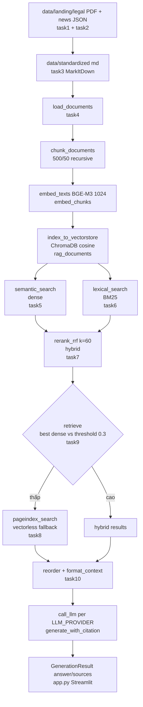

# Lý thuyết + Nghiệp vụ RAG trong `src/`

> Chủ đề repo: **Dịch vụ đại học — University Services** (`src/__init__.py:1`).
> Pipeline: `landing → standardized → chunk → embed → index → dense + BM25 → RRF → fallback → generation có citation`.
> Contract chung: `src/contracts.py`, `docs/MODULE_CONTRACTS.md`.

## Sơ đồ tổng thể



## 1. Chunking + Index — `src/task4_chunking_indexing.py`

### Lý thuyết
LLM giới hạn context và bị `lost-in-the-middle`. Chunking cắt văn bản dài thành đoạn độc lập để embed + retrieve chính xác, giảm noise và cost. Embedding đưa text về vector; câu cùng nghĩa thì cosine gần nhau. Vector DB lưu `id + vector + text + metadata` để tìm nearest neighbor.

### Nghiệp vụ dự án
- `load_documents()` (`task4:55`): đọc `data/standardized/**/*.md`, `id=relative_path`, `metadata={source,title,doc_type:legal|news,url}`. Giữ `source/title` để UI hiện nguồn.
- `chunk_documents()` (`task4:76`): `RecursiveCharacterTextSplitter(chunk_size=500, chunk_overlap=50, separators=["\n\n","\n",". "," ",""])`. Ưu tiên cắt đoạn → câu → từ. `id={doc}::chunk-{index}` + `chunk_index`. Overlap giữ mạch câu.
- `embed_texts()` (`task4:31`): dispatch theo `EMBEDDING_PROVIDER` trong `.env`. Mặc định `BAAI/bge-m3, DIM=1024`. Task4 và Task5 phải dùng chung hàm/model/dim.
- `get_collection()` (`task4:41`): `chromadb.PersistentClient(chroma_db)` + `get_or_create_collection(rag_documents, {hnsw:space:cosine})`.
- `embed_chunks()` + `index_to_vectorstore()` (`task4:98,109`): embed theo batch, giữ nguyên field, `upsert(ids,documents,embeddings,metadatas)` để chạy lại không trùng.

### Ví dụ
`quy-dinh-hoc-phi.md` 5000 ký tự → ~10 chunks `quy-dinh-hoc-phi.md::chunk-0..9`. Query học phí chỉ lôi chunk-2, chunk-5 vào prompt.

## 2. Semantic Search (Dense) — `src/task5_semantic_search.py:11`

### Lý thuyết
Dense retrieval tìm theo nghĩa: `query_vector=embed(query)`, `similarity=1-cosine_distance`, lấy `top_k` cao nhất. Hiểu paraphrase nhưng tốn embedding và kém với mã số/từ khóa chính xác.

### Nghiệp vụ
`semantic_search(query, top_k=10) -> SearchResult[method=dense, score 0-1, sort giảm dần]`. Dùng cho câu tự nhiên của sinh viên: "học phí đóng khi nào?" khớp "Học phí nộp theo học kỳ". Triển khai: `embed_texts([query])[0]` → `collection.query(query_embeddings, n_results=top_k)` → map `ids/documents/metadatas/distances`.

## 3. Lexical Search (BM25) — `src/task6_lexical_search.py`

### Lý thuyết
BM25 chấm theo tần suất từ (TF), độ hiếm (IDF), độ dài doc. Từ xuất hiện nhiều trong doc ngắn + hiếm toàn corpus → điểm cao. Không cần embedding, không hiểu nghĩa, mạnh với keyword, mã văn bản, tên riêng.

### Nghiệp vụ
- `CORPUS` là cùng chunks Task4.
- `build_bm25_index()`: `tokenized=[content.lower().split()] → BM25Okapi(tokenized)`.
- `lexical_search(query, top_k=10)`: `scores=get_scores(query.lower().split())`, `argsort[::-1]`, bỏ `score<=0`, `method=bm25`. Score không giới hạn (7.0, 5.0), không cộng trực tiếp với dense.
- Dùng cho: "Quyết định 123/CTSV?", "ký túc xá B?", "band descriptor IELTS?".

## 4. Reranking RRF — `src/task7_reranking.py:13`

### Lý thuyết
Dense và BM25 khác thang đo nên không cộng điểm. RRF chỉ dùng thứ hạng: `RRF(d)=sum(1/(k+rank))`, `rank` từ 1, `k=60` làm phẳng chênh lệch top. Doc top cả 2 bảng lên đầu. Không cần train.

### Nghiệp vụ
`rerank_rrf([dense,bm25], top_k=5, k=60) -> method=hybrid`. Dedup theo `id`, copy item rồi gán `score=RRF`. Ví dụ test: `chunk-1` hạng 2 dense + hạng 1 BM25 → `1/62+1/61` → top 1. Quy tắc: fuse đúng 1 lần; RRF score chỉ để sort, cấm dùng cho fallback.

## 5. PageIndex Vectorless — `src/task8_pageindex_vectorless.py`

### Lý thuyết
Vectorless không embed local. Service ngoài tự parse cấu trúc (mục, bảng, trang) và trả nodes liên quan. Hữu ích khi query out-of-domain, corpus mới chưa index, embedding local kém.

### Nghiệp vụ fallback
- `upload_documents()`: upload `data/standardized`, cache `source->documentID`. Nếu SDK không nhận `.md` thì convert PDF tạm.
- `pageindex_search(query, top_k=5) -> method=pageindex`: thiếu score thì gán giảm dần theo rank cho đủ contract.
- Cần `PAGEINDEX_API_KEY`, timeout + `try/except`. Lỗi provider không được crash UI, phải trả hybrid hoặc refusal.

## 6. Retrieval Pipeline — `src/task9_retrieval_pipeline.py:24`

### Lý thuyết
Pipeline là nhạc trưởng: phối hợp dense + lexical + RRF + fallback + threshold. Threshold là ngưỡng niềm tin: `best_dense < threshold` nghĩa là corpus không khớp nghĩa (câu ngoài domain) → fallback hoặc từ chối thay vì bịa.

### Luồng chuẩn
```python
dense = semantic_search(query, top_k*2)
sparse = lexical_search(query, top_k*2)
hybrid = rerank_rrf([dense, sparse], top_k) if use_reranking else dense[:top_k]
best = dense[0]["score"] if dense else 0.0
if best < score_threshold:  # default 0.3
    try:
        fallback = pageindex_search(query, top_k)
        if fallback: return fallback
    except Exception: pass
return hybrid[:top_k]
```
- Lấy `*2` để RRF có ứng viên, so threshold với cosine gốc dense, không phải RRF.
- `SCORE_THRESHOLD` phải calibrate bằng query in-domain vs out-of-domain, không có số đúng mọi corpus.
- Test bắt: confident `0.9` thì RRF 1 lần, fallback 0 lần; yếu `0.2` thì trả pageindex; fallback lỗi vẫn trả hybrid.

## 7. Liên hệ sang Generation (để đủ mạch)

`src/task10_generation.py`: `retrieve → reorder_for_llm (chống lost-in-the-middle) → format_context ([Document i|Title|Source]) → call_llm theo LLM_PROVIDER (openai|gemini|anthropic, TEMP=0.3, TOP_P=0.9) → GenerationResult`. Rỗng hoặc lỗi → safe refusal `"Tôi không thể xác minh..." + sources=[] + retrieval_source=none`.

## Tài liệu liên quan
- `docs/MODULE_CONTRACTS.md`: schema `Document/Chunk/SearchResult/GenerationResult`.
- `docs/STEP_BY_STEP.md`: thứ tự T1→T10.
- `docs/GRADING_RUBRIC.md`: Dense+BM25+RRF 20đ, Generation 15đ.
- `tests/test_contracts.py`, `tests/test_acceptance.py`: điều kiện pass.
